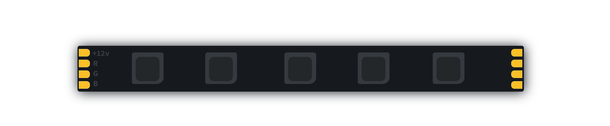

# ble-ledly
[](https://crates.io/crates/ble-ledly)


[](https://crates.io/crates/ble-ledly)


> _Customizable_ and _extensible_ cross-platform high-level _Bluetooth Low Energy_ light controller. 



Provides **out-of-the-box** support for generic _RGB_ led strips and **BLE** lamps and light bulbs.
Designed to be _extensible_, allows to implement your own devices, communication protocol or
both (_See the readme file for more_). Supports hardware specific animations (transferrable) and
software non-transferrable animations.

## Capabilities

Each device supports multiple capabilities available as featurs through *conditional compilation* in the _.toml_ file. 

```toml
ble-ledly = {version = "0.3", features = ["all"]}
```

Each _capability_ provides a single point access to a specific device characteristic that can be manipulated through the publicly available ``set()`` method. All the methods are available through the _standard API_ `Capability::set(opts)` or through more idiomatic methods as follow.

```rust
// standard
Light::set(light, &protocol, &LightOption::On).await?;

// idiomatic syntactic sugar
light.turn_on(&protocol).await?;
```

| Capability  | Description                                                                                   | Implemented? |
|-------------|-----------------------------------------------------------------------------------------------|--------------|
|` Light      ` | Light state (on/off)                                                                          |       ✅      |
|` Color      ` | Light Color (RGB)                                                                             |       ✅      |
|` Brightness ` | Light white levels                                                                            |       ✅      |
|` HWAnimate  ` | Hardware specific animations (subjected to protocol)                                          |       ✅      |
|` SWAnimate  ` | Software animation (require continuous communication, but allows custom effect on any device) |       ✅      |
|` Temperature` | Light temperature (K)                                                                         |              |


## Animations

### Transferrable vs. Non-transferrable

_Transferrable animations_ are _built-in_ in the _target ble device_ which takes care of driving the led(s); once the command is sent, __no extra communication needed__ between the __client and ble light controller__. _Non-transferrable_ animations bypass the controller's built-in effects and allow for higher degree of customization while providing support for legacy or cheap _light controllers_ allowing to provide effects otherwise not available to the target device. As a consequence, this requires __continuous connection__ between the _controller and client_.

## Current support

| Animation         | Capability | Color Support                          | Implemented? |
|-------------------|------------|----------------------------------------|--------------|
| Pulsating         | HWAnimate  | Red/Green/Blue                         |       ✅      |
| Breathing         | SWAnimate  | RGB/Any                                |       ✅      |
| Rainbow Pulsating | HWAnimate  | N/A                                    |              |
| Pulsating Bicolor | HWAnimate  | Red/Green, Red/Blue, Green/Blue        |              |
| Rainbow flashing  | HWAnimate  | N/A                                    |              |
| Cross-fade        | SWAnimate  | RGB/Any                                |              |
| Rainbow jumping   | HWAnimate  | N/A                                    |              |
| Flashing          | HWAnimate  | Red, Green, Blue, Yellow, Purple, Cyan |              |

## Extensibility

This library has been designed with _extensibility in mind_.

- It is possible to create your own _device_ by implementing the `Device` trait and use the _built-in_ communication protocol.
- You can add your own __communication protocol__ by implementing the `Protocol` trait and use it to drive one of the built-in devices.
- Create your own `device` and `communication protocol`.

## Usage

An example using built-in _device_ **LedDevice** and _GenericRGB_ communication protocol.
For more examples, see the [examples](https://github.com/espressoshock/ble-ledly/tree/main/examples) folder.

### Minimal Configuration

```rust
#[tokio::main]
async fn main() -> Result<(), Box<dyn Error>> {

    // Create a new Light controller with prefix
    // Auto-filter devices that contain the prefix
    let mut controller = Controller::<LedDevice>::new_with_prefix("QHM-").await?;

    // Connect
    controller.connect().await?;

    // Choose your communication protocol
    let protocol = GenericRGB::default();

    // set default write characteristic for all connected
    // devices
    controller.set_all_char(&CharKind::Write, &UuidKind::Uuid16(0xFFD9))?;

    // Setting first found light color to red
    let first_light = controller.list().get(0).unwrap();
    first_light.color(&protocol, 255, 0, 0).await?;

    Ok(())
}
```
### Light controls

```rust
use ble_ledly::capability::color::*;
use ble_ledly::capability::light::*;
use ble_ledly::capability::sw_animate::*;
use ble_ledly::communication_protocol::generic_rgb::GenericRGB;
use ble_ledly::controller::Controller;
use ble_ledly::device::led_device::LedDevice;

use std::error::Error;
use std::time::Duration;
use tokio::time;

#[tokio::main]
async fn main() -> Result<(), Box<dyn Error>> {
    // Create a new Light controller
    let mut controller = Controller::<LedDevice>::new().await?;

    // Discover devices (scan)
    let led_devices = controller.device_discovery().await?;

    // inspect all found devices
    for device in led_devices.iter() {
        println!("Found device: {}", device);
    }
    // filter devices
    let lights: Vec<LedDevice> = led_devices
        .into_iter()
        .filter(|device| device.name.contains("QHM-"))
        .collect();

    // Connect
    controller.connect(Some(lights), None).await?;

    // Choose your communication protocol
    let protocol = GenericRGB::default();

    // list all connected devices
    let connected_lights = controller.list();
    for light in connected_lights.iter_mut() {
        println!("Connected to : {}", light.name);

        // Control the lights
        println!("Turning light on...");
        light.turn_on(&protocol).await?;

        // Set color
        println!("Setting color...");
        light.color(&protocol, 255, 0, 0).await?;
        time::sleep(Duration::from_millis(800)).await;
        light.color(&protocol, 0, 255, 0).await?;
        time::sleep(Duration::from_millis(800)).await;
        light.color(&protocol, 0, 0, 255).await?;
        time::sleep(Duration::from_millis(800)).await;

        println!("SW Animation - Breathing effect...");
        light
            .breathing(
                &GenericRGB {},
                &ColorOption::RGB(255, 0, 0),
                &SWAnimationRepeat::FiniteCount(2),
                &SWAnimationSpeed::Fastest,
            )
            .await?;
        light
            .breathing(
                &GenericRGB {},
                &ColorOption::RGB(0, 255, 0),
                &SWAnimationRepeat::FiniteCount(2),
                &SWAnimationSpeed::Fastest,
            )
            .await?;
        light
            .breathing(
                &GenericRGB {},
                &ColorOption::RGB(0, 0, 255),
                &SWAnimationRepeat::FiniteCount(2),
                &SWAnimationSpeed::Fastest,
            )
            .await?;

        // Control the lights
        println!("Turning light off...");
        light.turn_off(&protocol).await?;
    }

    Ok(())
}
```
## Contributing

Open a PR or issue

## License

MIT
